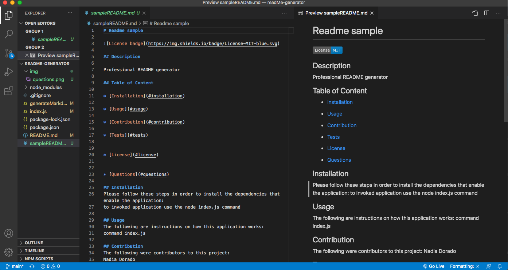

# Easypeasy Professional README Generator


## Description 

This is a command-line application that runs with Node.js and the Inquirer package, that dynamically generates a professional README.md file from a user's input. The README generated by this application includes: name of the project, description, a working clickable table of content, usage, contributions, tests, license, questions, and a badge for the selected license. 

## Table of Content  

* [Installation](#installation)

* [Technology](#technology)

* [Usage](#usage)

* [Contributions](#contributions)

* [License](#license)

* [Questions](#questions)

## Installation    

*Steps require to install this project and to get the development environment running:*

- In order to use this application, first you need to run the command below in the terminal:  
```bash
npm i
```
## Technology
- JavaScript
- Node.js
- Inquirer package 

## Usage
- Link to a walkthrough video that demonstrates its functionality:

    *   [Easypeasy Professional README Generator Walkthrough Video](https://vimeo.com/538200180 )

1. Run the following command: 

```bash
node index.js 
```
2. Answer the questions prompt in the command line.


3. Click the file name sampleReadme to do any changes, updates and/or edits. 


## Contributions

The following were contributors to this project: [Nadia Dorado](https://github.com/ndorado3)

## License
MIT

Copyright (c) [2021] [Nadia Dorado]

Permission is hereby granted, free of charge, to any person obtaining a copy of this software and associated documentation files (the "Software"), to deal in the Software without restriction, including without limitation the rights to use, copy, modify, merge, publish, distribute, sublicense, and/or sell copies of the Software, and to permit persons to whom the Software is furnished to do so, subject to the following conditions:

The above copyright notice and this permission notice shall be included in all copies or substantial portions of the Software.

THE SOFTWARE IS PROVIDED "AS IS", WITHOUT WARRANTY OF ANY KIND, EXPRESS OR IMPLIED, INCLUDING BUT NOT LIMITED TO THE WARRANTIES OF MERCHANTABILITY, FITNESS FOR A PARTICULAR PURPOSE AND NONINFRINGEMENT. IN NO EVENT SHALL THE AUTHORS OR COPYRIGHT HOLDERS BE LIABLE FOR ANY CLAIM, DAMAGES OR OTHER LIABILITY, WHETHER IN AN ACTION OF CONTRACT, TORT OR OTHERWISE, ARISING FROM, OUT OF OR IN CONNECTION WITH THE SOFTWARE OR THE USE OR OTHER DEALINGS IN THE SOFTWARE.

## Questions 
For questions about this project please contact me:  
* Email: nadiadorado@gmail.com 
* Github: (https://github.com/ndorado3) 
